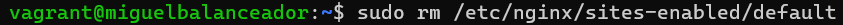
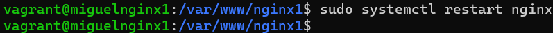

# Ejercicio de balanceo de carga sobre dos servidores

>En este ejercicio lo que se propone es crear cuatro máquinas virtuales, una de ellas actuará como balanceador de carga, la cual tendrá una red publica mediante la cual los usuarios se podrán conectar a nuestro balanceador, y una red privada que será la misma donde están conectados los dos servidores. Dos de las cuatro máquinas serán nuestros servidores web, que, en este caso, trabajamos con Nginx, estos servidores tendrán dos redes privadas, una para poder conectarse con el balanceador, y otra para poder conectarse con el servidor donde está alojado MySQL. En la última máquina, tendremos MySQL con la correspondiente base de datos de nuestra aplicación.
 
# Configuración de las máquinas

>Todas las configuraciones de las cuatro máquinas, salvo algunas configuraciones que deberemos estar dentro de la propia máquina, se harán mediante un script de aprovisionamiento para agilizar el proceso de configuración de las máquinas.

# Balanceador de carga

>Primeramente, actualizamos repositorios con sudo apt update y upgrade. Después de actualizar repositorios, instalamos el servidor web que va a tener nuestro balanceador, que en este caso es Nginx.

>En el Vagrant File configuramos nuetro balanceador de carga con una dirección IP publica, mediante la cual los usuarios van a poder conectarse a nuestro servidor donde tenemos la aplicación. También tiene una dirección IP privada que, esta dirección, sirve para tener conexión con los servidores donde tenemos nuestra aplicación. La máquina está provisionada mediante un script.

>Comprobamos que, después de instalar Nginx en el balanceador, el servicio está corriendo perfectamente en nuestro balanceador.

>Comprobamos que tenemos conectividad con los servidores donde alojaremos nuestra aplicación. Estos servidores tienen que estar en la misma red que nuestro balanceador.

>Para empezar a configurar nuestro balanceador de carga, primero tenemos que eliminar el fichero "default" del directorio /etc/nginx/sites-enabled.

>Ahora, creamos el fichero donde alojaremos la configuración para que la maquina actue como balanceador de carga. La configuración sería la siguiente:

>Comprobamos que hemos hecho bien la configuración del archivo con el siguiente comando:

>Como podemos ver, no tenemos ningún error de sintaxis, con lo cual, la configuración del fichero se ha realizado correctamente.

>Por último, reiniciamos Nginx para aplicar las configuraciones realizadas.

# Servidores Nginx

>Primeramente, actualizamos repositorios con sudo apt update y upgrade. Después, instalamos Nginx, php-fpm y php-mysql.

>En el vagrant file, configuramos nuestros servidores con dos direcciones IP privadas, una de ellas servirá para conectarse con el balanceador de carga, y la otra dirección IP servirá para conectarse con el servidor MySQL. Ambas máquinas son provisionadas a través de un script.

>La siguiente configuración es aplicable a ambas máquinas.

>Comprobamos tras la instalación que el servicio está corriendo perfectamente en nuestra máquina.

>Dentro del directorio /var/www tenemos que crear un directorio en el cual tendremos alojados todos los archivos referentes a nuestra aplicación.

>Tras crear el directorio, cambiamos el dueño y el grupo al que pertenece ese directorio.

>Dentro de ese directorio, clonamos el repositorio donde están todos los archivos de nuestra aplicación.

>Dentro de el repositorio clonado, se encuentra un directorio llamado "src", cuyo contenido son los archivos de la aplicacion. Todo el contenido de este directorio lo movemos al directorio que hemos creado al principio.

>Borramos el repositorio despues de mover los archivos.

>Dentro del directorio /etc/nginx/sites-available se encuentra un archivo llamado "default". Tenemos que hacer una copia de este archivo, en este caso la copia del archivo se llama sitionginx.

>Dentro de este archivo, en la linea donde pone root /var/www/html, tenemos que cambiar el directorio html por el directorio que hemos creado al principio donde tenemos los archivos de la aplicación.

>Después de configurar la copia del fichero "default", tenemos que hacer un enlace del fichero "sitionginx" para que se encuentre en el directorio sites-enbabled. Comprobamos que hemos creado correctamente el enlace

>La configuración del siguiente fichero es para que Nginx pueda interpretar código PHP. En este caso, para que Nginx pueda interpretar código PHP, haremos la configuración de un socket TCP/IP

>En el apartado "listen" del fichero tenemos que indicar que Nginx y PHP van a estar en la misma máquina, con lo cual, tenemos que poner la dirección localhost, es decir, la dirección 127.0.0.1, y el puerto donde va a escuchar, por ejemplo el 9000.

>Despues de configurar este archivo, reiniciamos el servicio php7.4-fpm.

>Volvemos a configurar la copia del archivo "default".

>En la linea donde están los archivos index con varias extensiones, tenemos que poner index.php para que Nginx pueda buscar archivos con extensión .php y poder leerlos. También hay que descomentar varias lineas del archivo, y en la linea donde pone "fastcgi_pass", tenemos que volver a poner la dirección localhost y el puerto (127.0.0.1:9000).

>Tras hacer dicha configuración, con el comando "nginx -t" comprobamos que no hay ningún error en la configuración que hicimos.

>Después de realizar las configuraciones, reiniciamos Nginx.

>Una vez realizados los pasos anteriores, tenemos que configurar nuestro servidor para que pueda conectarse con el servidor MySQL.

>Empezamos esta configuración editando el archivo "config.php".

>En el apartado 'DB_HOST', tenemos que indicarle la dirección IP del servidor MySQL, que es 192.168.6.10.

>Después de editar el archivo, reiniciamos Nginx.

>Instalamos el cliente de MySQL para poder conectarnos al servidor.

>Comprobamos que la configuración se ha realizado correctamente conectandonos al servidor con el comando "mysql -u (usuario que creamos en el servidor MySQL) -p -h (dirección IP del servidor MySQL)".

# Servidor MySQL

>Primero, actualizamos repositorios con sudo apt update y upgrade. Una vez hecho esto, instalamos MySQL y le asignamos una contraseña al root.

>En el Vagrant File, configuramos nuestro servidor de base de datos con una dirección IP privada, mediante la cual, los servidores podrán conectarse a él. La máquina se aprovisiona mediante un script.

>Vemos que, tras haber instalado MySQL, el servicio está corriendo perfectamente.

>Editamos el archivo "50-server-cnf" que se encuentra en el directorio /etc/mysql/mariadb.conf.d.

>En el campo bind-address tenemos que poner la dirección IP de la máquina donde está corriendo MySQL, que, en este caso, es 192.168.6.10.

>Reiniciamos MySQL tras haber modificado el archivo anterior.

>Nos metemos dentro de MySQL y creamos el usuario que tendrá nuestra aplicación para acceder a la base de datos y le asignamos todos los privilegios sobre la base de datos de la aplicación. Cuando ponemos 'nombre usuario'@'%', el simbolo % significa que el usuario se podrá conectar desde cualquier maquina al sevidor de base de datos, siempre y cuando las máquinas estén en la misma red que el servidor. Comprobamos que se ha creado el usuario correctamente.

>Volviendo a nuestra máquina, a simple vista creemos que todo funciona, pero para que funcione, necesitamos tener una base de datos en la cual almacenar diferentes tipos de datos, para ello, tenemos que volver a clonar el repositorio que clonamos anteriormente y, entrar dentro del directorio "db", en el cual se encuentra el archivo de creación de la base de datos llamado "databse.sql".

>En este fichero tenemos que eliminar las tres ultimas lineas, ya que la creación del ususario y la asignación de privilegios lo hemos hecho antes. Con lo cual el archivo queda así.

>A continuación, importamos el fichero de creación de la base de datos a nuestro servidor.

>Comprobamos que la base de datos ha sido creada correctamente.

>Después de hacer todo esto, reiniciamos MySQL.